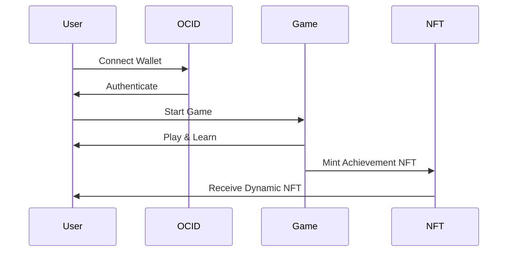
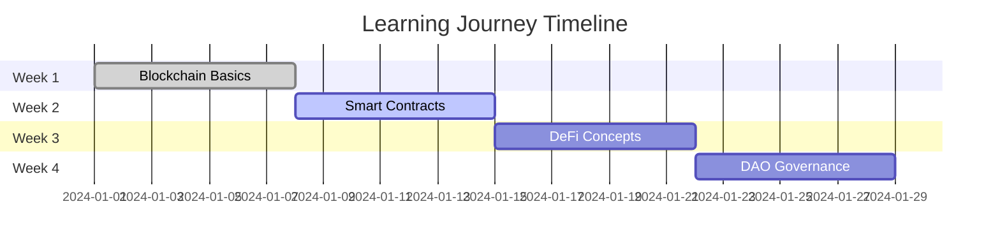

<div align="center">
  
  
  # 🚀 IntelliLearn
  
  ### *The Future of Blockchain Learning*
  
  [](https://il-core.vercel.app/)
  [](https://x.com/Intellilearn_ec)
  [](LICENSE)
  [](https://github.com/pranshurastogi/IntelliLearn)
  
  > **🎮 Learn Web3 by Playing Games | 🏆 Earn Dynamic NFTs | 🔐 Decentralized Identity**
  
  ---
</div>

## 🎯 What is IntelliLearn?

IntelliLearn transforms blockchain education into an interactive gaming experience. Instead of boring lectures, you **play games** to master Web3 concepts. Each game teaches real blockchain principles while you have fun!

<div align="center">
  
  ```mermaid
  graph LR
    A[Connect Wallet] --> B[Choose Game]
    B --> C[Play & Learn]
    C --> D[Earn Tokens]
    D --> E[Get NFTs]
    E --> F[Level Up]
    F --> A
    
    style A fill:#FF6B8A
    style B fill:#FFA45C
    style C fill:#FFD166
    style D fill:#06D6A0
    style E fill:#118AB2
    style F fill:#073B4C
  ```
  
</div>

## 🎮 Interactive Game Preview

Try this mini-game right in your README! Click the buttons below to simulate learning:

<div align="center">

| 🎯 **Archery Pro** | ⛏️ **Block Miner** | 🚀 **Code Quest** | 🏰 **DAO Dungeon** |
|:---:|:---:|:---:|:---:|
| <button onclick="alert('🎯 Bullseye! You learned about blockchain consensus!')" style="background: linear-gradient(45deg, #FF6B8A, #FFA45C); color: white; border: none; padding: 10px 20px; border-radius: 10px; cursor: pointer; font-weight: bold;">🎯 Take Shot</button> | <button onclick="alert('⛏️ Block mined! You earned 10 IL tokens!')" style="background: linear-gradient(45deg, #FFA45C, #FFD166); color: white; border: none; padding: 10px 20px; border-radius: 10px; cursor: pointer; font-weight: bold;">⛏️ Mine Block</button> | <button onclick="alert('🚀 Quest completed! You unlocked OCID knowledge!')" style="background: linear-gradient(45deg, #FFD166, #06D6A0); color: white; border: none; padding: 10px 20px; border-radius: 10px; cursor: pointer; font-weight: bold;">🚀 Start Quest</button> | <button onclick="alert('🏰 DAO conquered! You understand governance!')" style="background: linear-gradient(45deg, #06D6A0, #118AB2); color: white; border: none; padding: 10px 20px; border-radius: 10px; cursor: pointer; font-weight: bold;">🏰 Enter Dungeon</button> |

</div>

## 📊 Platform Statistics

<div align="center">

| Metric | Value | Trend |
|:---:|:---:|:---:|
| 🎮 **Active Games** | 4 | 📈 |
| 👥 **Active Learners** | 10+ | 🚀 |
| 📚 **Courses Available** | 1+ | 📊 |
| 🪙 **Tokens Distributed** | - | 💰 |
| ⚡ **Uptime** | 99.9% | 🔥 |

</div>

## Open Campus Tasks :
-- Design user persona of your top users and take intervews - [Notion Interviews](https://fish-danger-0c8.notion.site/224a690956ce805ba17cfa03e1c7f161?v=224a690956ce80c69f98000cb7eba4d4&source=copy_link)

## 🎯 Our Games

### 1. 🎯 **Archery Pro - Blockchain Quiz**
> *Learn blockchain fundamentals through precision shooting*

```javascript
// Game Logic Preview
const blockchainConcepts = {
  consensus: "Proof of Work vs Proof of Stake",
  blocks: "How blocks are created and linked",
  mining: "The mining process and rewards",
  security: "Cryptographic principles"
};
```

**🎮 How to Play:**
- Adjust angle and power to hit targets
- Each target represents a blockchain concept
- Answer questions to score points
- Learn while having fun!

### 2. ⛏️ **Block Miner Challenge**
> *Collect falling coins while learning Web3 facts*

**🏆 Features:**
- Fast-paced arcade gameplay
- Real-time Web3 education
- Token earning system
- Progressive difficulty

### 3. 🚀 **OpenCampus Code Quest**
> *Navigate space while mastering OCID concepts*

**🌟 Learning Outcomes:**
- Understanding decentralized identity
- OCID protocol mechanics
- Web3 authentication
- Privacy principles

### 4. 🏰 **DAO Dungeon Escape**
> *Explore governance through dungeon crawling*

**🗝️ Key Concepts:**
- DAO structure and voting
- Token-based governance
- Community decision making
- Smart contract interactions

## 🔐 OCID Integration

<div align="center">



</div>

**🔑 What is OCID?**
- **Open Campus ID** - Decentralized identity for education
- **Self-sovereign** - You own your data
- **Verifiable** - On-chain credentials
- **Interoperable** - Works across platforms

## 🛠️ Tech Stack

<div align="center">

| Frontend | Backend | Blockchain | Database |
|:---:|:---:|:---:|:---:|
|  |  |  |  |
|  |  |  |  |
|  |  |  |  |

</div>

## 🚀 Quick Start

### Prerequisites
- Node.js 18+ 
- npm or yarn
- MetaMask or any Web3 wallet

### Installation

```bash
# Clone the repository
git clone https://github.com/pranshurastogi/IntelliLearn.git
cd IntelliLearn

# Install dependencies
npm install
# or
yarn install

# Set up environment variables
cp .env.example .env.local
# Edit .env.local with your Supabase and Thirdweb credentials

# Run the development server
npm run dev
# or
yarn dev
```

### Environment Setup

Create a `.env.local` file:

```env
# Supabase Configuration
NEXT_PUBLIC_SUPABASE_URL=your_supabase_project_url
NEXT_PUBLIC_SUPABASE_ANON_KEY=your_supabase_anon_key

# Thirdweb Configuration
NEXT_PUBLIC_THIRDWEB_CLIENT_ID=your_thirdweb_client_id
```

## 🎯 Live Demo

<div align="center">

[](https://il-core.vercel.app/)

**🌐 Live at:** [https://il-core.vercel.app/](https://il-core.vercel.app/)

</div>

## 📈 Learning Progress Tracking

<div align="center">



</div>

## 🏆 Achievement System

| Achievement | Description | Reward |
|:---:|:---|:---:|
| 🎯 **First Shot** | Complete your first game | 50 IL Tokens |
| ⛏️ **Block Master** | Mine 100 blocks | 200 IL Tokens |
| 🚀 **Quest Champion** | Complete all quests | 500 IL Tokens |
| 🏰 **DAO Lord** | Master governance | 1000 IL Tokens |
| 🔥 **Streak Master** | 7-day learning streak | Dynamic NFT |

## 🤝 Contributing

We love contributions! Here's how you can help:

1. **🎮 Add New Games** - Create educational games
2. **📚 Improve Content** - Enhance learning materials
3. **🐛 Report Bugs** - Help us improve
4. **💡 Suggest Features** - Share your ideas

```bash
# Fork the repository
# Create a feature branch
git checkout -b feature/amazing-game

# Make your changes
# Commit with a descriptive message
git commit -m "Add amazing blockchain game"

# Push to your branch
git push origin feature/amazing-game

# Open a Pull Request
```

## 📞 Connect With Us

<div align="center">

[](https://x.com/Intellilearn_ec)
[](https://discord.gg/intellilearn)
[](mailto:hello@intellilearn.xyz)

</div>

## 📄 License

This project is licensed under the MIT License - see the [LICENSE](LICENSE) file for details.

## 🙏 Acknowledgments

- **OpenCampus** for OCID protocol
- **Thirdweb** for Web3 infrastructure
- **Supabase** for backend services
- **Vercel** for hosting
- **Our amazing community** of learners and contributors

---

<div align="center">

**🌟 Made with ❤️ by the IntelliLearn Team**

*Empowering the future of decentralized education, one game at a time.*

[](https://github.com/pranshurastogi/IntelliLearn)
[](https://github.com/pranshurastogi/IntelliLearn)
[](https://github.com/pranshurastogi/IntelliLearn/issues)

</div>
