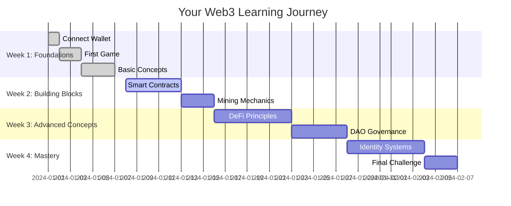

<div align="center">
  
  
  # 🌟 IntelliLearn
  
  ### *Where Learning Meets Adventure in the Web3 Universe*
  
  [](https://il-core.vercel.app/)
  [](https://x.com/Intellilearn_ec)
  [](LICENSE)
  
  > **🎮 Learn Web3 by Playing Games | 🏆 Earn Dynamic NFTs | 🔐 Decentralized Identity | 🌟 Build Your Digital Legacy**
  
  ---
</div>

## 🎭 Your Web3 Learning Adventure Begins Here

Imagine a world where learning blockchain isn't about memorizing complex concepts, but about embarking on epic quests, solving puzzles, and earning rewards that actually matter. Welcome to **IntelliLearn** - where every game is a lesson, every achievement is a milestone, and every player becomes a Web3 master.

<div align="center">
  
  ```mermaid
  graph LR
    A[🌟 Connect Your Wallet] --> B[🎯 Choose Your Quest]
    B --> C[🎮 Play & Learn]
    C --> D[🏆 Earn Rewards]
    D --> E[🔐 Build Identity]
    E --> F[🚀 Level Up]
    F --> A
    
    style A fill:#FF6B8A,stroke:#FF6B8A,stroke-width:4px
    style B fill:#FFA45C,stroke:#FFA45C,stroke-width:4px
    style C fill:#FFD166,stroke:#FFD166,stroke-width:4px
    style D fill:#06D6A0,stroke:#06D6A0,stroke-width:4px
    style E fill:#118AB2,stroke:#118AB2,stroke-width:4px
    style F fill:#073B4C,stroke:#073B4C,stroke-width:4px
  ```
  
</div>

## 🎮 Your Gaming Universe Awaits

### 🎯 **Archery Pro - Precision Meets Knowledge**
*Master blockchain fundamentals through the art of precision shooting*


**What You'll Learn:**
- 🔗 **Blockchain Basics** - What makes a blockchain tick
- 🔐 **Cryptographic Security** - How hashing protects data
- ⛏️ **Mining Mechanics** - The art of block creation
- 🏗️ **Consensus Protocols** - Proof of Work vs Proof of Stake

### ⛏️ **Block Miner Challenge - Dig Deep, Learn Fast**
*Collect falling coins while absorbing Web3 wisdom*

**Your Journey:**
- 🚀 **Fast-Paced Action** - Quick reflexes meet quick learning
- 📚 **Real-Time Education** - Facts drop as fast as coins
- 🏆 **Progressive Difficulty** - Each level challenges your skills
- 💰 **Token Rewards** - Earn while you learn

### 🚀 **OpenCampus Code Quest - Navigate the Digital Cosmos**
*Pilot your ship through the vast expanse of OCID knowledge*

**Discover:**
- 🆔 **Decentralized Identity** - Own your digital self
- 🔑 **OCID Protocol** - The future of authentication
- 🛡️ **Privacy Principles** - Control your data
- 🌐 **Web3 Authentication** - Beyond passwords

### 🏰 **DAO Dungeon Escape - Governance Through Adventure**
*Navigate treacherous dungeons while mastering DAO mechanics*

**Master:**
- 🗳️ **Voting Mechanisms** - How DAOs make decisions
- 🏛️ **Governance Structures** - From proposals to execution
- 🤝 **Community Building** - The power of collective action
- ⚡ **Smart Contract Interactions** - The backbone of DAOs

### 💳 **Snapcard - Share Knowledge, Build Connections**
*Create and share interactive learning cards with your network*

**Connect:**
- 🎨 **Custom Cards** - Design your own learning challenges
- 👥 **Social Learning** - Challenge friends and colleagues
- 📊 **Progress Tracking** - See how your network grows
- 🌟 **Achievement Sharing** - Celebrate learning milestones

## 🔐 Your Digital Identity Journey

<div align="center">
  
  ```mermaid
  sequenceDiagram
    participant You as 🌟 You
    participant OCID as 🔐 OCID
    participant Games as 🎮 Games
    participant NFTs as 🏆 NFTs
    participant Network as 🌐 Network
    
    You->>OCID: Connect Your Wallet
    OCID->>You: Welcome to Your Digital Self
    You->>Games: Start Your Learning Quest
    Games->>You: Play, Learn, Grow
    Games->>NFTs: Mint Your Achievements
    NFTs->>You: Your Digital Legacy
    You->>Network: Share Your Journey
    Network->>You: Join the Community
  ```
  
</div>

**🔑 What is OCID?**
- **Your Digital Passport** - One identity across all platforms
- **Self-Sovereign** - You own your data, always
- **Verifiable** - On-chain credentials that matter
- **Interoperable** - Works everywhere in the Web3 ecosystem

## 🏆 Your Achievement System

<div align="center">

| 🎯 **First Steps** | ⛏️ **Deep Diver** | 🚀 **Cosmic Explorer** | 🏰 **Dungeon Master** | 💳 **Network Builder** |
|:---:|:---:|:---:|:---:|:---:|
| Complete your first game | Master all mining levels | Navigate the OCID cosmos | Conquer DAO governance | Create 10 Snapcards |
| **50 IL Tokens** | **200 IL Tokens** | **500 IL Tokens** | **1000 IL Tokens** | **Dynamic NFT** |

</div>

## 📊 Your Learning Dashboard

<div align="center">



</div>

## 🚀 Ready to Begin Your Adventure?

<div align="center">

[](https://il-core.vercel.app/)

**🌐 Live at:** [https://il-core.vercel.app/](https://il-core.vercel.app/)

</div>

## 🛠️ Built for the Future

<div align="center">

| Frontend | Backend | Blockchain | Identity |
|:---:|:---:|:---:|:---:|
|  |  |  |  |
|  |  |  |  |
|  |  |  |  |

</div>

## 🎯 Quick Start for Developers

### Prerequisites
- Node.js 18+ 
- npm or yarn
- MetaMask or any Web3 wallet

### Installation

```bash
# Clone the repository
git clone https://github.com/pranshurastogi/IntelliLearn.git
cd IntelliLearn

# Install dependencies
npm install
# or
yarn install

# Set up environment variables
cp .env.example .env.local
# Edit .env.local with your Supabase and Thirdweb credentials

# Run the development server
npm run dev
# or
yarn dev
```

### Environment Setup

Create a `.env.local` file:

```env
# Supabase Configuration
NEXT_PUBLIC_SUPABASE_URL=your_supabase_project_url
NEXT_PUBLIC_SUPABASE_ANON_KEY=your_supabase_anon_key

# Thirdweb Configuration
NEXT_PUBLIC_THIRDWEB_CLIENT_ID=your_thirdweb_client_id
```

## 🤝 Join Our Community

<div align="center">

[](https://x.com/Intellilearn_ec)
[](https://discord.gg/intellilearn)
[](mailto:hello@intellilearn.xyz)

</div>

## 📚 Open Campus Resources

* Design user persona of your top users and take interviews - [Notion Interviews](https://fish-danger-0c8.notion.site/224a690956ce805ba17cfa03e1c7f161?v=224a690956ce80c69f98000cb7eba4d4&source=copy_link)
* IntelliLearn TRD - [IntelliLearn TRD](https://fish-danger-0c8.notion.site/IntelliLearn-TRD-228a690956ce804c8d93deb39b84f03b?source=copy_link)
* IntelliLearn PSD - [IntelliLearn PSD](https://fish-danger-0c8.notion.site/IntelliLearn-PSD-228a690956ce80478f45d78a32e35d71?source=copy_link)
* Intellilearn Business Model - [Intellilearn Business Model](https://fish-danger-0c8.notion.site/Intellilearn-Business-Model-22ba690956ce807eb349d3ccf12d05db?source=copy_link)
* Intellilearn Innovation mission map - [Intellilearn Innovation mission map](https://fish-danger-0c8.notion.site/Intellilearn-Innovation-mission-map-22ba690956ce80d1ae2fdc4a34d0a3b3?source=copy_link)

## 📄 License

This project is licensed under the MIT License - see the [LICENSE](LICENSE) file for details.

## 🙏 Acknowledgments

- **OpenCampus** for OCID protocol and vision
- **Thirdweb** for Web3 infrastructure
- **Supabase** for backend services
- **Vercel** for hosting
- **Our amazing community** of learners and contributors

---

<div align="center">

**🌟 Made with ❤️ by the IntelliLearn Team**

*Empowering the future of decentralized education, one adventure at a time.*

[](https://github.com/pranshurastogi/IntelliLearn)
[](https://github.com/pranshurastogi/IntelliLearn)
[](https://github.com/pranshurastogi/IntelliLearn/issues)

</div>
